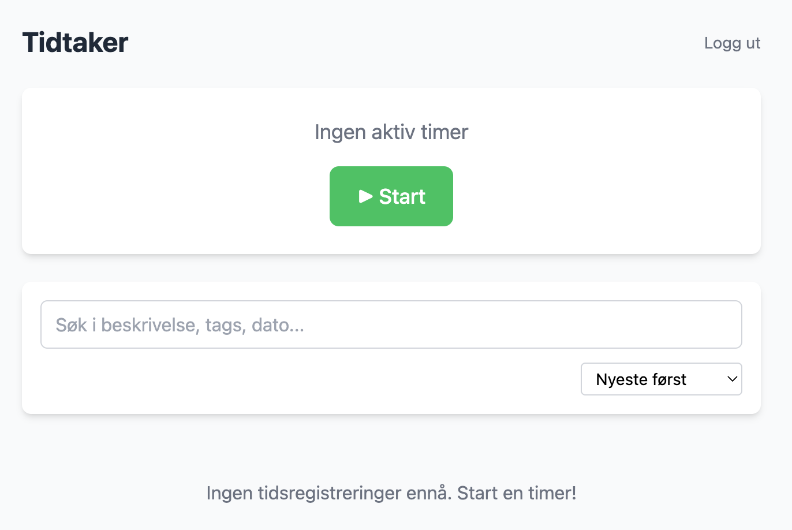

# Agenter
Du har allerede fått en forsmak på agenter. I de forrige oppgavene ba vi agenten om å lagre resultatet også til en fil. En kan skru av "agent"-modusen ved å velge _Ask_ på knappen til venstre for modellen, men typisk vil ikke agenten gjøre noe du ikke ber om. I verste tilfelle kan en alltids angre endringene ved å trykke på knappen _Undo_.

## Oppgave: Starte tidtaker-applikasjonen
1. Bruk [beskrivelsen i tidtaker.md](../tidtaker.md) for å starte tidtaker-tjenesten.
2. Det kan ta noe tid før alle avhengigheter er lastet ned.
3. Når applikasjonen har startet, klikk på adressen i terminalen:

> 2026/06/01 11:50:30 Server started at http://127.0.0.1:8090

4. Registrer deg en bruker.
5. Verifiser at du er inne:



## Oppgave: Endre tidtaker-applikasjonen
1. Start og stopp en tidtakning.
2. Legg merke til at datoen skrives som "02.06.2026".
3. Prøv denne instruksen:

> I applikasjonen tidtaker vises datoen til en tidtaking som "02.06.2026", men jeg ønsker format på formen "2. juni 2026". Kan du endre implementasjonen?

Stopp og start applikasjonen for å sjekke at det virker.

## Oppgave: Spare mer tid
Det fungerte kanskje bra? Men det var også en veldig enkel endring. Dersom vi var kjent i kodebasen, sparte det oss kanskje for 1 minutt, dersom vi ikke var så kjent, noen minutter flere.

Det vi ønsker, er å spare oss så mange minutter som mulig, i en instruks.

Hva ville du typisk også gjort, når du legger til en ny feature? Kanskje lagt til en test, oppdatert dokumentasjon og kjørt testene?

Fjern resultatet fra sist og prøv denne instruksen:

> I applikasjonen tidtaker vises datoen til en tidtaking som "21.04.2026", men jeg ønsker format på formen "21. april 2026". Kan du legge til en test, verifisere at testen feiler, fikse implementasjonen, verifisere at testen er OK og oppdatere dokumentasjonen i README.md og templating.md? Gjør også en sikkerhetsvurdering, er det trygt å endre koden? Lag til slutt en commit-melding med tittel og body som forklarer hva som er endret og hvorfor, la output være en git-kommando jeg kan kjøre selv.


## Oppgave: Unngå å skrive samme instrukser på ny og ny
Instruksene i forrige melding er "standard" programvareutvikling. En ønsker alltid å gå gjennom samme liste med ting. Det tar kanskje ikke så lang tid å skrive, men det er fort gjort å glemme en ting. (Har du lest [the checklist manifesto](https://www.ark.no/produkt/boker/hobbyboker-og-fritid/the-checklist-manifesto-9781782835943)?)

Når du oppdager at du gir samme instruks på ny og på ny, kan du legge til instruksen i filen AGENTS.md. Den blir alltid lagt til i lag med instruksene dine fra chaten.

Legg til dette i filen AGENTS.md i roten av repo:

```markdown
Dette er et kurs med en eksempelapplikasjon _tidtaker_ der alle kodeendringer gjøres.

Når du gjør endringer, gjør alltid disse stegene:

1. Legg til en test som du sjekker at feiler, før du fikser implementasjonen og sjekker suksess for testen (TDD). Foretrekk ende-til-ende tester i tests/e2e.
2. Kjør alle testene og bygg når du er ferdig.
3. Oppdatere dokumentasjonen i README.md og eventuelt andre relevante .md-filer.
4. Gjør en sikkerhetsvurdering, er det trygt å endre koden?
5. Lag til slutt en commit-melding med tittel og body som forklarer hva som er endret og hvorfor, la output være en git-kommando jeg kan kjøre selv, inklusive git push.
```

Undo endringene fra forrige instruks og prøv denne:

> En tidtaking vises som "21.04.2026", men jeg ønsker format på formen "21. april 2026". Kan du endre implementasjonen?

Trykk på _Keep_ og bruk git kommando fra agenten for å lagre endringene.

Neste steg er [05-feilsøking.md](05-feilsøking.md).
